## GSCA Overview

<br>

* An open source software package with a powerful Graphical User Interface (GUI).

* Interactively visualize and explore gene and gene set activities in 25,000+ human and mouse biological contexts.

* Systematically identify biological contexts associated with specific gene set activity patterns. 

* Discover previously unknown contexts of gene set functions.

---

## Background

* 200,000+ gene expression samples stored in public databases such as GEO and ArrayExpress.

* PED contain vast amount of information, but not fully utilized so far.

<!-- Microarray dataset 1 generated by one investigator for studying pathway 2 may also contain information about pathway 1. This information may not be used by the original investigator for his/her study of pathway 2, but it can be useful for other people who want to study pathway 1 --> 

<center>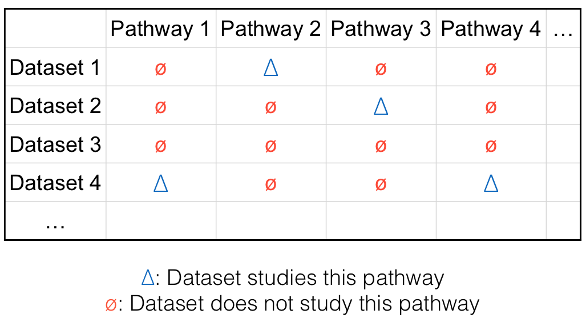</center>

---

## Challenges

<br>

* Reuse of PED enables one to systematically examine gene or pathway’s activities in a broad spectrum of biological contexts, saving resources of generating the data.

* Several roadblocks to be removed before PED can be reused:

      + Gene expression data should be constantly normalized and annotated.

      + Data should be easy to visualize and retrieve.

      + One needs efficient way to analyze the data and turn them into useful knowledge.

* None of these is trivial given the complexity, heterogeneity and size of the data.

---

## ChIP-PED

* Analyzes the expression of a transcription factor (TF) and its target genes in PED to find biological contexts associated with the function of the TF.

* Myc: a regulator gene that codes for a transcription factor.

<center>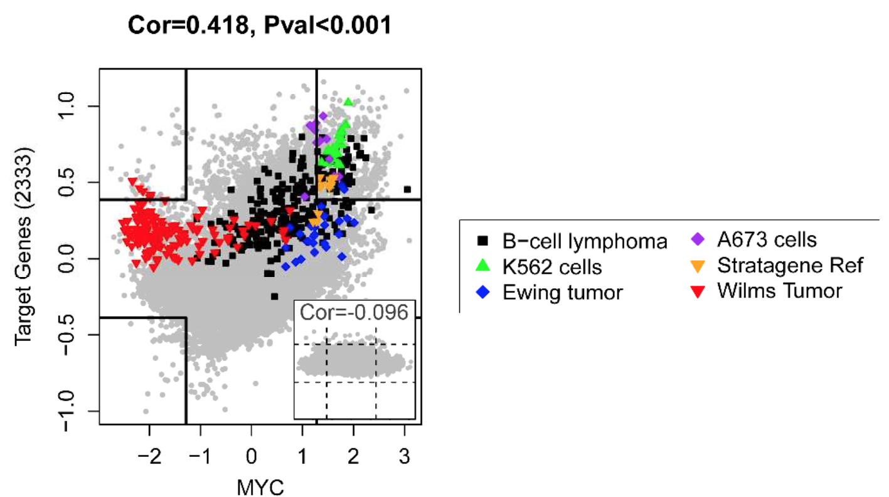</center>

---

## ChIP-PED

* Knockdown of MYC: substantially slower proliferation rate and decreased tumorigenicity.

<center>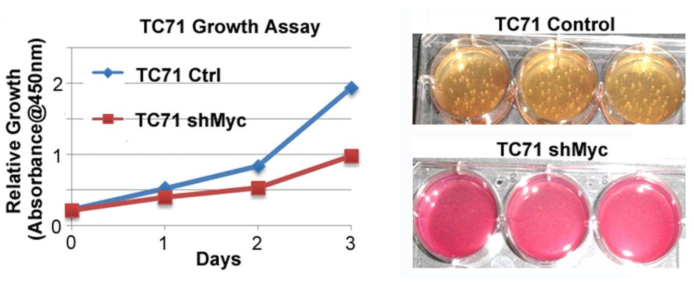</center>

---

## ChIP-PED Limitations

<br>

* Can only analyze one TF and its target genes.

* The gene expression pattern is limited (TF+TG+; TF+TG-; TF-TG+; TF-TG-)

* Only command-lines. Hard to use.

---

## GSCA

<br>

* Built upon 25,000+ pre-normalized and expert-annotated human and mouse gene expression samples with 1000+ biological contexts.

* Takes any number of gene sets of any kind as inputs (ChIP-PED: one TF and its target genes).

* Allows users to identify biological contexts associated with highly complex gene expression patterns (ChIP-PED: basic and limited gene expression patterns).

* Provides a powerful GUI for users to import gene sets, visualize data, tune parameters, perform cross-species analyses, and export analysis results and plots (ChIP-PED: only command-line tools).

---

## GSCA workflow

<center>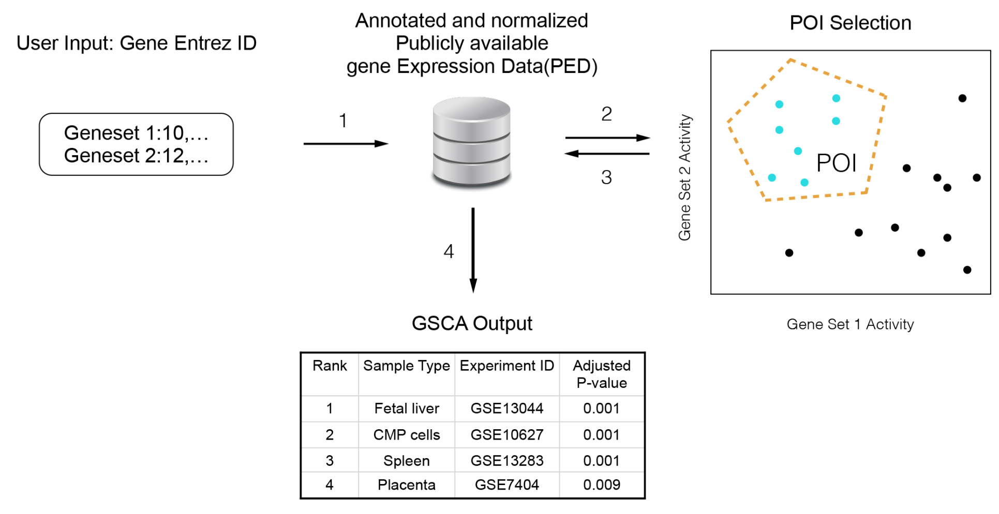</center>

---

## GSCA: Conjugate to GSEA

<center>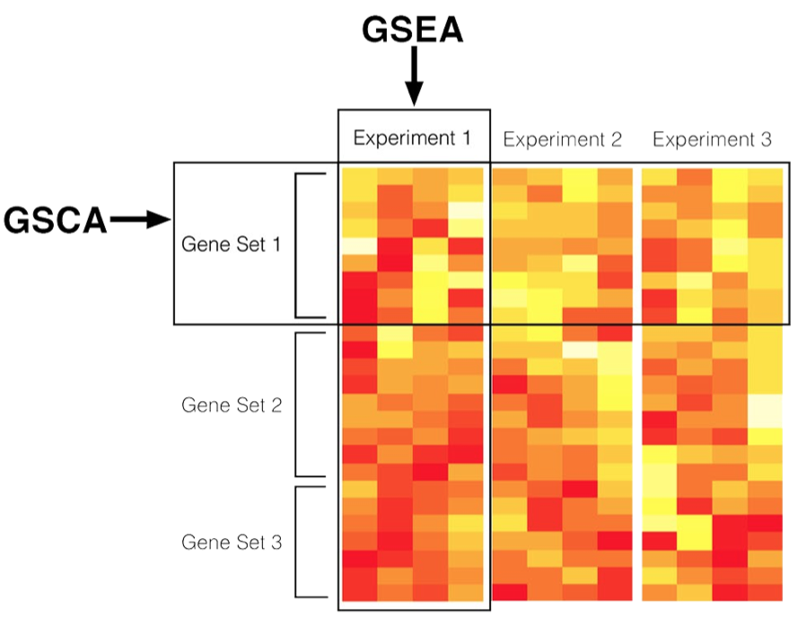</center>

---

## GSCA GUI

<center>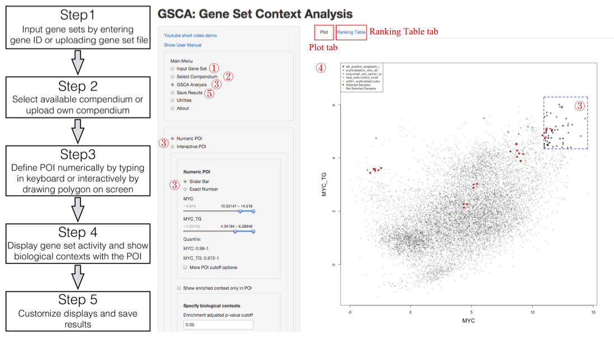</center>

---

## Data Packages

<br>

* Affymetrix Human Genome U133a Array (GPL96) : 11778 human samples on 12495 genes

* Affymetrix Mouse Genome 430 2.0 Array (GPL1261) : 9444 mouse samples on 20630 genes

* Affymetrix Human Genome U133 Plus 2.0 Array (GPL570) : 5153 human samples on 19944 genes

* Affymetrix Human Genome U133A 2.0 Array (GPL571) : 313 human samples on 12494 genes

---

## Example I: Oct4 High Expression

<center></center>

---

## Example I: Oct4 Middle Expression

<center></center>

---

## Example II: Gli1 and Nanog

<br>

* The Gli proteins are the effetors of Hedgehog signaling and have been shown to be involved in cell fate determination, proliferation and patterning in many cell types and organs during embryo development.

* Nanog is a critical pluripotency marker that is expressed in embryonic stem cells.Neural stem cells also express Nanog and require secreted Hedgehog signaling to maintain proliferation and to regulate differentiation.

---

## Example II: Gli1 and Nanog

<br>

Gli1 high expression; Nanog low expression

<center>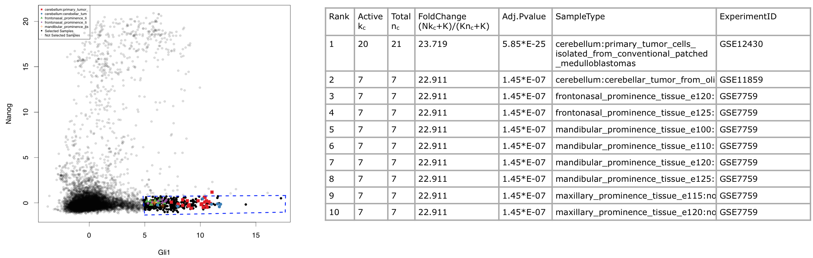</center>


---

## Example II: Gli1 and Nanog

<br>

Gli1 high expression; Nanog high expression

<center>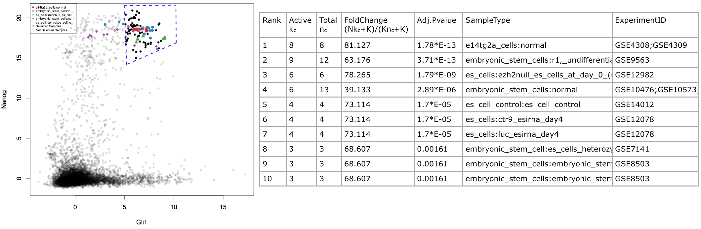</center>

---

## Example II: Gli1 and Nanog

<br>

Gli1 high expression; Nanog medium expression

<center>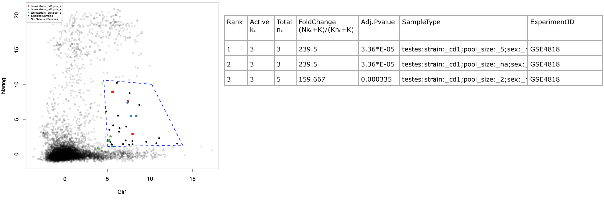</center>

---

## Example III: MYC and Metabolic Pathways 

<br>

MYC, mitochondria biogenesis, glycolysis and fatty acid oxidation

<center>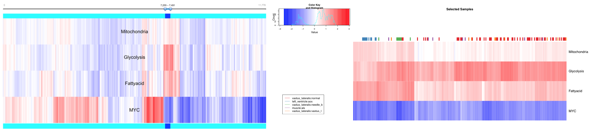</center>

---

## Example III: MYC and Metabolic Pathways 

<br>

Top ranked biological contexts:

<center>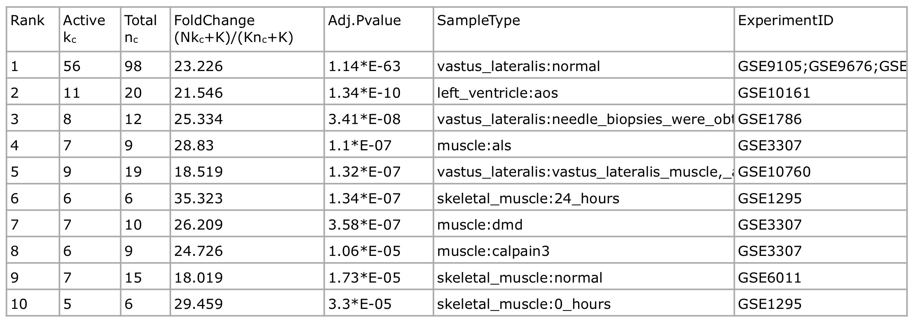</center>

---

## Example III: MYC and Metabolic Pathways 

<br>

<center>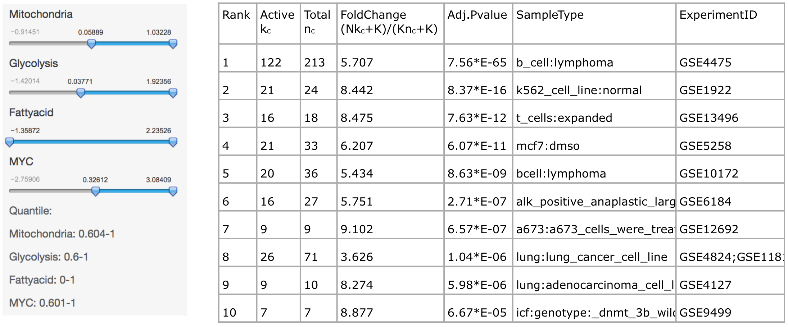</center>

---

## Example III: MYC and Metabolic Pathways 

<br>

<center>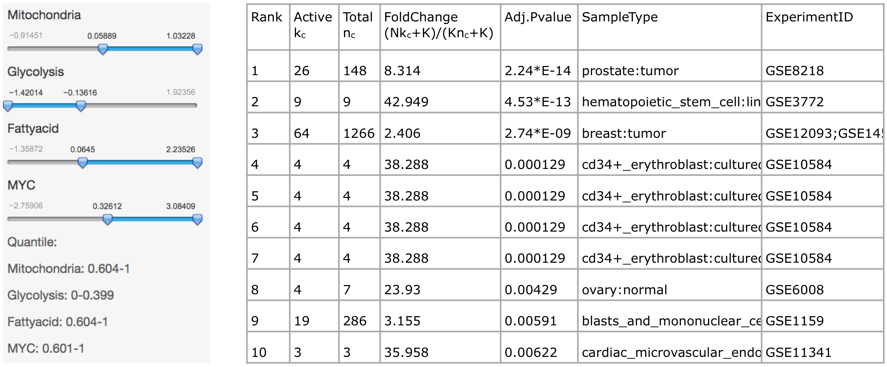</center>

---

## Example III: MYC and Metabolic Pathways 

<br>

<center></center>

---

## Example III: MYC and Metabolic Pathways 

<br>

<center>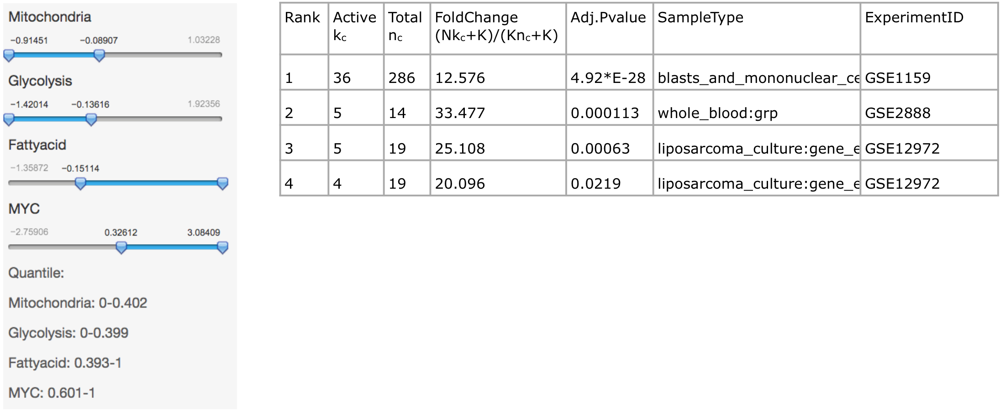</center>

---

## Install GSCA

1. Install R 

2. Install at least one of the four data packages from Bioconductor

      
      ```r
      source("http://bioconductor.org/biocLite.R")
      biocLite("Affyhgu133aExpr")
      ```

3. Install GSCA from Github: https://github.com/zji90/GSCA

      
      ```r
      if (!require("devtools"))
        install.packages("devtools")
      devtools::install_github("GSCA","zji90")
      ```
      
4. Launch GSCA GUI:

      
      ```r
      library(GSCA)
      GSCAui()
      ```
      

---

## GSCA Resources

<br>

* GSCA github home page: https://github.com/zji90/GSCA

* GSCA online user interface: http://spark.rstudio.com/jzc19900805/GSCA

* GSCA demonstration video: https://www.youtube.com/watch?v=1OeZ1PAUMhw

---

## Demo


--- .segue .dark

Thank you!
-----


